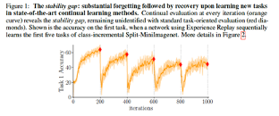

Online Continual Learning in a Task Incremental Scenario on CLEAR dataset
============

Optional project of the [Streaming Data Analytics](http://emanueledellavalle.org/teaching/streaming-data-analytics-2022-23/) course provided by [Politecnico di Milano](https://www11.ceda.polimi.it/schedaincarico/schedaincarico/controller/scheda_pubblica/SchedaPublic.do?&evn_default=evento&c_classe=811164&polij_device_category=DESKTOP&__pj0=0&__pj1=1b82965d3c68857e2087d3f3b98a9e40).

Student: **[To be assigned]**

Online Continual Learning **(OCL)** ([Link 1](https://arxiv.org/abs/2003.09114), [Link 2](https://arxiv.org/abs/2101.10423)), is an emerging CL paradigm that blends the quick adaptability of Streaming ML with the knowledge retention of Continual Learning (CL). Each experience is unavailable at once, but the model receives a mini-batch at a time containing a low number of data points (usually 10). Additionally, each minibatch’s training is performed in a single pass (one epoch).

In this context, models can suffer from the STABILITY GAP: \

[New metrics](https://arxiv.org/abs/2205.13452) were introduced to compare the models:
- **Average Forgetting**: After each minibatch's training, it computes, for each previous experience’s test, the difference between the accuracy of the current model and the accuracy of the model trained on that experience. It then computes the average on all the previous experiences. The result is a value for each mini-batch. It is possible to plot the trend. \

- **Average Minimum Accuracy (min-ACC)**: After each minibatch's training, it computes the accuracy of the current model on each previous experience’s test and averages them. At the end of the experience, it takes the minibatch that minimizes it. Finally, it averages the minimum of the different experiences. The result is a value for each experience. \

- **Worst Case Accuracy (WC-Acc)**: After the last minibatch of the last experience, it computes a weighted mean between the current model’s accuracy on the current experience’s test set and its Average Minimum Accuracy. \

Avalanche ([Home page](https://avalanche.continualai.org/), [API](https://avalanche-api.continualai.org/en/v0.3.1/)) implements this paradigm using the class OnlineCLScenario.
Moreover, a recent [survey](https://arxiv.org/abs/2308.10328) compares different strategies and provides the [code](https://github.com/AlbinSou/ocl_survey).

The first goal of this project is to compare different CL strategies in an Online CL Scenario on the [CLEAR](https://linzhiqiu.gitbook.io/the-clear-benchmark/) benchmark. CLEAR is a novel continual/lifelong benchmark that captures real-world distribution shifts in Internet image collection from 2004 to 2014. It contains 11 experiences, each representing a specific year. 

Particularly, we are interested in the CLEAR-10 that contains images from classes. Build a Task Incremental Scenario in which each experience represents a specific year. When adding the knowledge associated with the new year, we want to check if the strategies can remember the ones associated with previous years. For example, when learning to recognize the computers of 2014 it can still recognize the computers of 2004.

Each mini-batch must be balanced concerning the 10 classes of the experience.

You must implement the following strategies using Avalanche:
- **ER** (you can use the version provided directly by Avalanche API version or the Plugin implemented in the paper’s code)
- **LwF** (you can use the version provided directly by Avalanche API version)
- **ER + LwF** (you can use the Plugin described in the paper’s code)
- **AGEM** (you can use the Plugin described in the paper’s code)
- **PNNs** (you can use the version provided directly by Avalanche API version)
- **Naive strategy** (you can use the version provided directly by Avalanche API version)

For the Naive strategy, implement both SingleHead and MultiHead versions. For the other strategies, implement only the MultiHead version.
When you implement the OnlineCLScenario, be sure that the train_mb_size equals 10. Train the models for only one epoch.

As a **base learner**, you must use the same as the mentioned paper (Resnet18).
See src.factories.method_factory for the paper's code implementation.

Use the following metrics to compare the strategies:
- **WC-ACC** (final values)
- **Average Min-ACC** (one value for each experience)
- **Average forgetting** (plot the values after each mini-batch)
- **Previous experiences’ accuracy** (plot the values after each mini-batch). Use the same values computed for Average Min-Acc without taking the minimum of each experience. 
- **Current experience accuracy trend**: After each minibatch’s training,  plot the accuracy on the current experience’s test set. 
- **Next experience’s accuracy**: after each minibatch’s training, plot the accuracy on the next experience’s test set.
You can compute them after the whole execution using the values that Avalanche calculated.

The second goal is to compare, using the classical CL metrics (BwT, FwT, A Metric and Avg Accuracy) computed after the training on each experience, the strategies applied in the OCL scenario and the same strategies applied in the CL scenario that assumes each experience to be available in one shot and model to be allowed to iterate on them for multiple epochs (you can use 2 or 3 epochs).

You are required to create a single ipynb file. You must include comments for the principal instructions, and you are allowed to import external py modules. Additionally, ensure you thoroughly comment on the comparison results using various plots associated with the different metrics. Finally, again, within each ipynb file, briefly discuss the conclusions that can be drawn from the experiment.

## Note for Students

* Clone the created repository offline;
* Add your name and surname into the Readme file;
* Make any changes to your repository, according to the specific assignment;
* Add a `requirement.txt` file for code reproducibility and instructions on how to replicate the results;
* Commit your changes to your local repository;
* Push your changes to your online repository.

